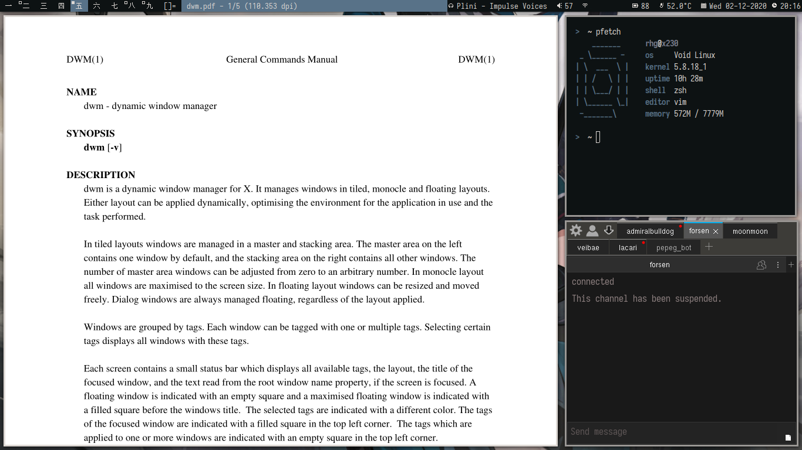

# dwm
lightly costumized build of suckless's window manager -- dwm

# patches
- actual fullscreen
- autostart
- uselessgaps
- statuscmd - for [dwmblocks](https://github.com/torrinfail/dwmblocks)

# screenshot

